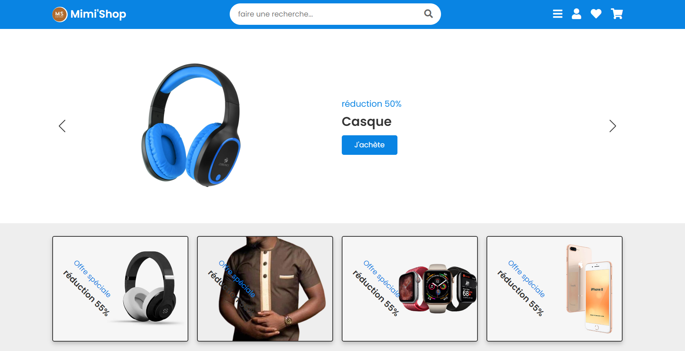
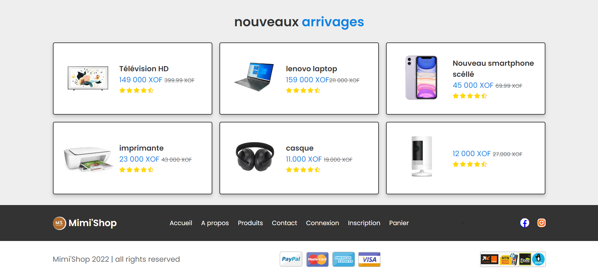
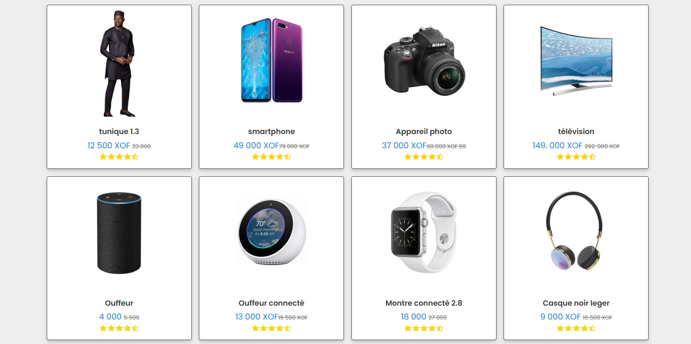
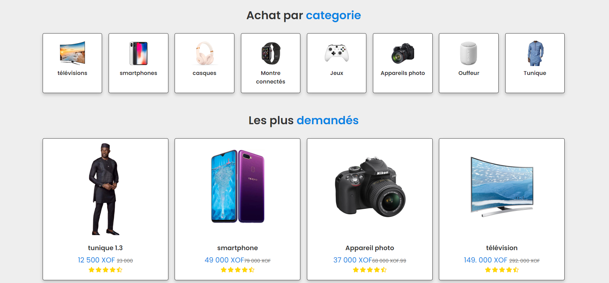
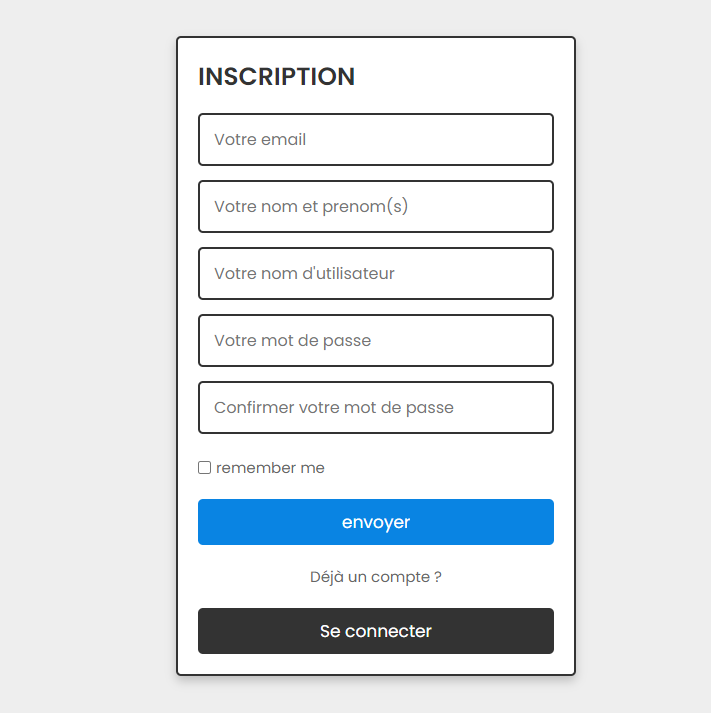
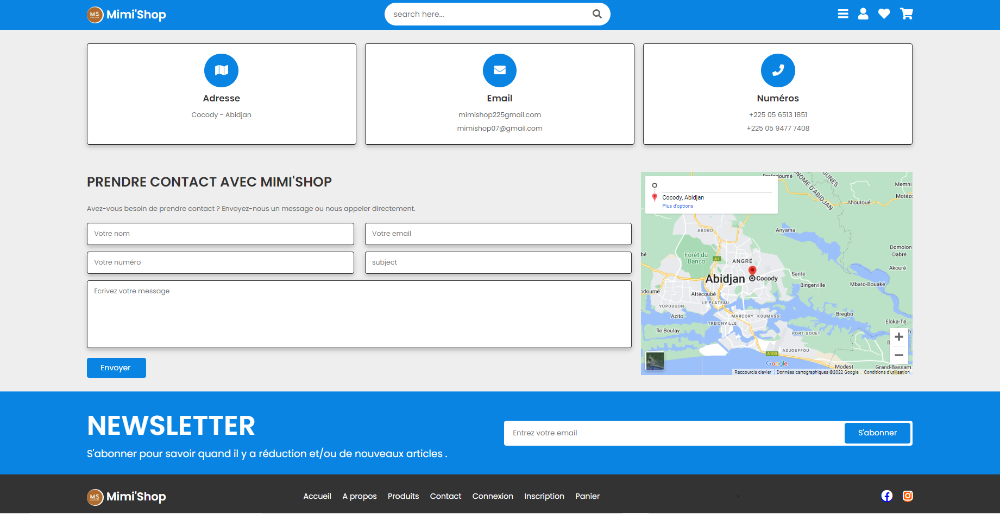

# mimiShop
 Site de vente en ligne : uniquement UI

### Features
<ul>
    <li>Accueil </li>
    <li>Inscription / Connexion </li>
    <li>A propos </li>
    <li>Panier </li>
    <li>Contact </li>
</ul>

### Acueil 

     
    

### Produit 

     
    

### Inscription / Connexion 

     
    

### Contact 

     

#### Ne pas hesiter à forker, lâcher une étoile et/ou telecharger le projet. A bientôt et surtout développez-vous bien !
